# <p align="center">Automated API tests for [REQRES.IN](https://reqres.in)</p>

<p align="center" ><a href="https://reqres.in">

</a></p>

# :link: Contents
- [Tools and Istruments](#wrench-tools-and-instruments)
- [How to run the automated tests](#gear-running-the-api-tests)
- - [Local](#computer-local-test-run)
- - [Using Jenkins](#img-width3-titlejenkins-srcmediaimagesjenkins-logosvg-remote-with-jenkins)
- [Allure TestOps](#img-width3-titleallure-testops-srcmediaimagesallure-testops-logosvg-allure-testops-integration)
- [Allure Reports](#img-width3-titleallure-reports-srcmediaimagesallure-report-logosvg-allure-reports-integration)
- [Test Results](#ledger-test-results)
- - [Report](#example-of-a-test-run-report)
- - [Telegram](#img-width3-titletelegram-srcmediaimagestelegram-logosvg-telegram-test-result-notification)
- [Jira](#img-width4-titlejira-srcmediaimagesjira-logosvgjira-integration)


# 	:wrench: Tools and Instruments

<p  align="center">
  <code></code>
  <code></code>
  <code></code>
  <code></code>
  <code></code>
  <code></code>
  <code></code>
  <code></code>
  <code></code>
  <code></code>
</p>

# Example of API automation test

- [x] <code>GET</code> single user data list
- [x] Testing <code>DELETE</code> a user
- [x] Unsuccessful user registration with <code>POST</code>
- [x] Method <code>GET</code> for resource list
- [x] Testing for <code>Status Codes</code>

# :gear: Running the API tests

## :computer: Local Test Run

To run the API tests locally:
```bash
gradle clean test
```

##  Remote with [Jenkins](https://jenkins.autotests.cloud/job/C23-mikenvico-reqresApiTests/)


<p align="center">
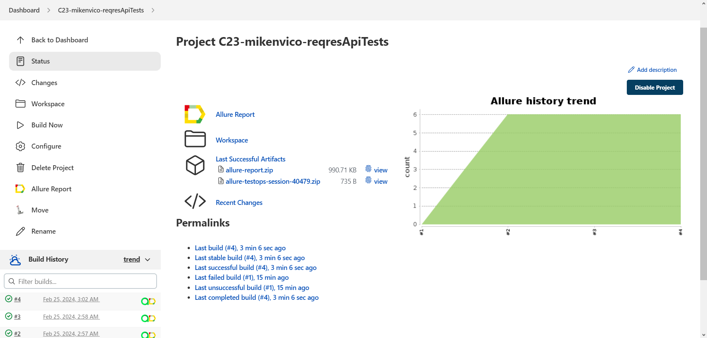
</p>

### How to run the remote API tests in Jenkins

>To run this test through Jenkins, press button :arrow_forward:<code>Build Now</code>.\
You can see the results via Allure Reports, or use the link to Allure TestOps on the same page.
<p align="center">
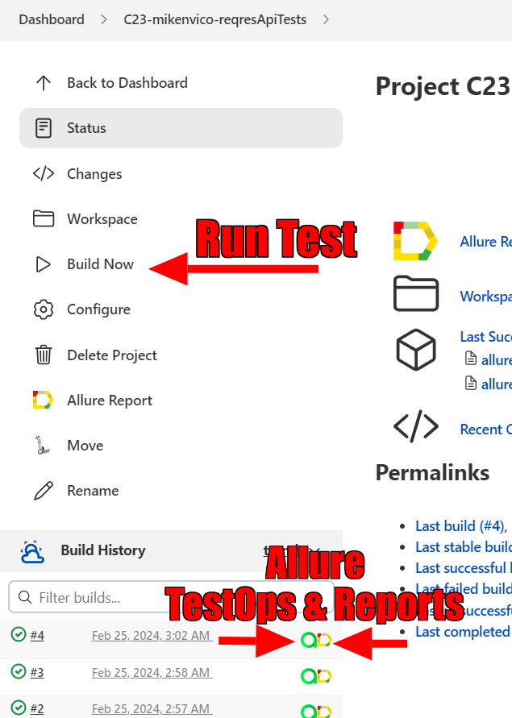
</p>


## [Allure TestOps](https://allure.autotests.cloud/project/4070/dashboards) Integration

### Dashboard

<p align="center">
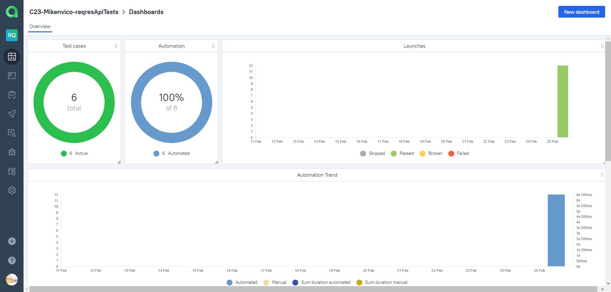
</p>

---

### Test Cases

<p align="center">
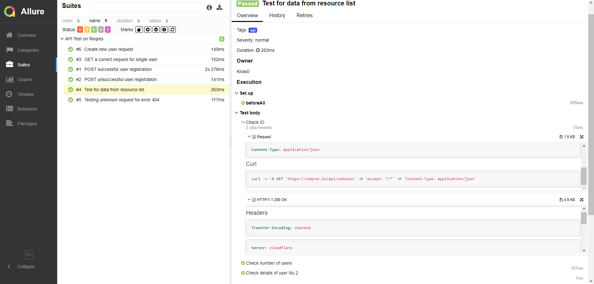
</p>

---

### Launches

 <p align="center">
 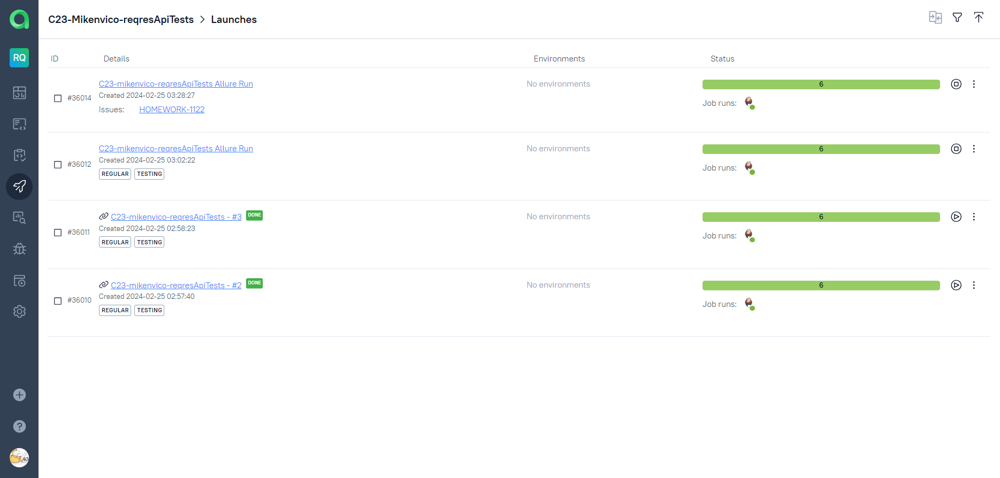
 </p>


## [Allure Reports](https://jenkins.autotests.cloud/job/C23-mikenvico-visitacityTests/allure/) Integration

### Local Allure Overview

<p align="center">
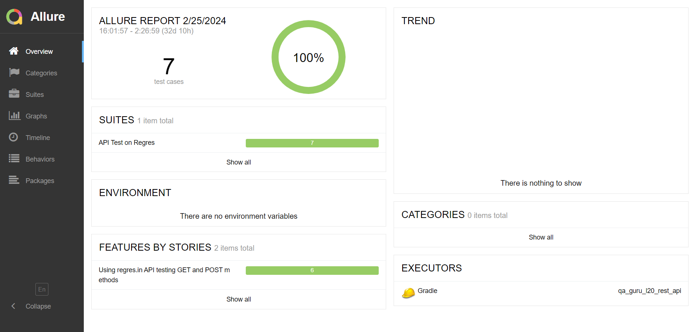
</p>

---

### Jenkins Allure Overview

<p align="center">
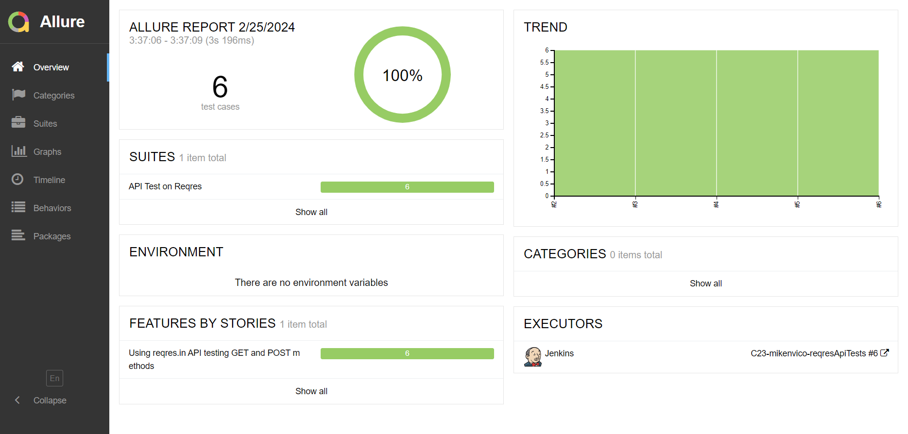
</p>

---

### Graphs

<p align="center">
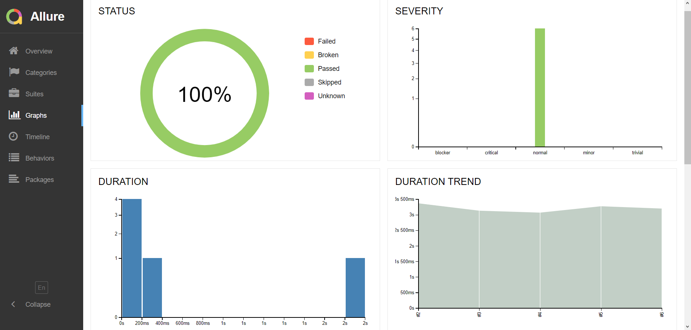
</p>

## :ledger: Test Results

---

### Example of a Test Run report

> This page presents the standard distribution of the tests run by user stories and test suites.
> 
<p align="center">

</p>

>Extra addon .ftl files fot easier user reading mode.

<p align="center">
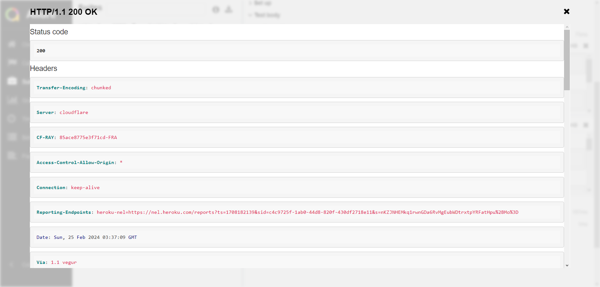
</p>

---

###  Telegram test result notification

> After tests are finished Telegram Bot sends test result notification.

<p align="center">
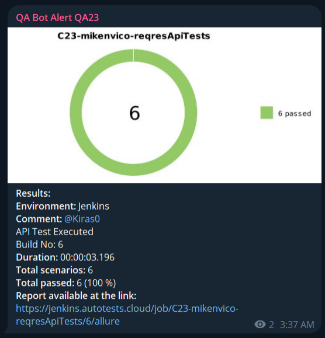
</p>

---

## Jira Integration

<p align="center">
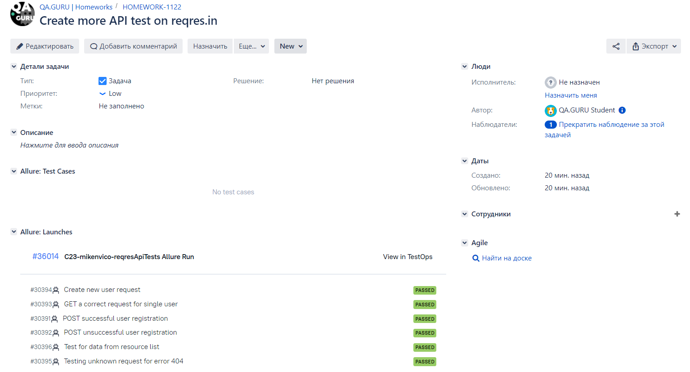
</p>
